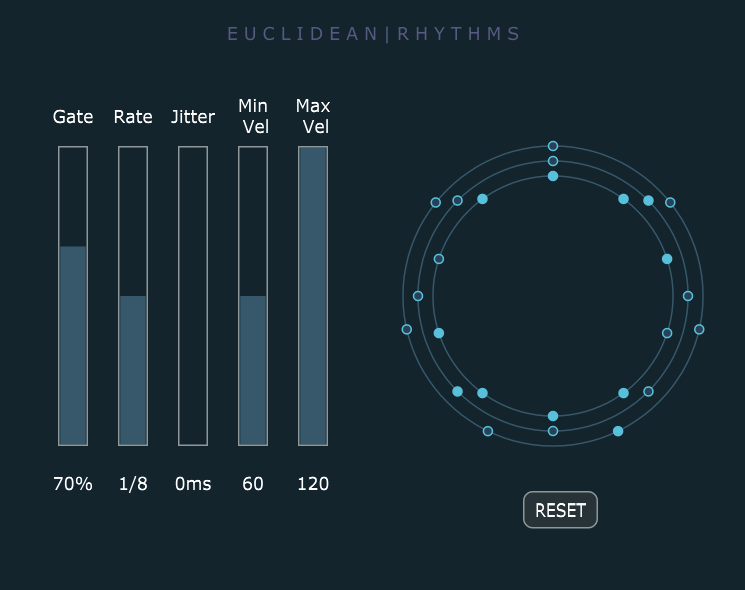

# Euclidean-Rhythm-VST-Plugin

This repository contains a VST Plugin that could be used to produce Euclidean Rhythms. The JUCE framework has been used for this.

## Project Abstract

In a paper published in 2005 Professor Godfried Toussaint of McGill University investigated Euclidean Rhythms and it’s relevance in multiple fields. The goal of Euclidean rhythms is to generate beat or pulse patterns that are uniformly dispersed throughout a certain amount of time intervals. These rhythms are algorithmically created and have a mathematical foundation, allowing for exact control over their rhythmic structure. Euclidean rhythms have been employed in various musical genres, including electronic, world, and experimental music, to create engaging and innovative rhythmic textures. Multiple Euclidean Rhythms can be played synchronously to create complex polyrhythms.

This project provides a VST (Virtual Studio Technology) plugin intended to generate Euclidean rhythms in response to MIDI input, filling a critical gap in readily available music creation tools. The thesis is divided into six complete chapters, beginning with an introduction, following which a detailed literature study elucidates the importance of Euclidean rhythms in music and reveals a dearth of user-friendly software solutions in this arena. The next chapters go into requirements gathering, design concepts, low-level design, implementation using the JUCE framework, and extensive testing and evaluation, all of which contribute to the plugin’s robustness and efficiency. This research aims to bridge the gap between music theory, software engineering, and user interface design, culminating in a transformative VST plugin that allows musicians and producers to explore the creative possibilities of Euclidean rhythms in their music production endeavours with ease.

## Screenshot

## How to setup?

- Download JUCE from this [link](https://juce.com/get-juce/).
- Open the Projucer.
- Select File > Open.
- Navigate to the location of this repository.
- Double click on the `.jucer` file.
- This will open the project inside the projucer.
- You can open the project in an IDE of your choice by clicking the logo of your IDE inside the projucer.
